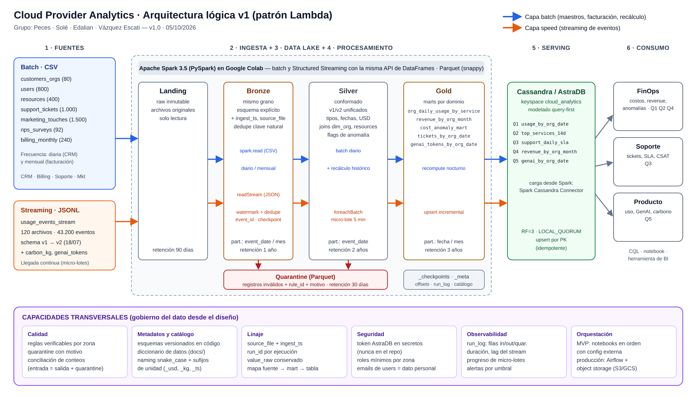
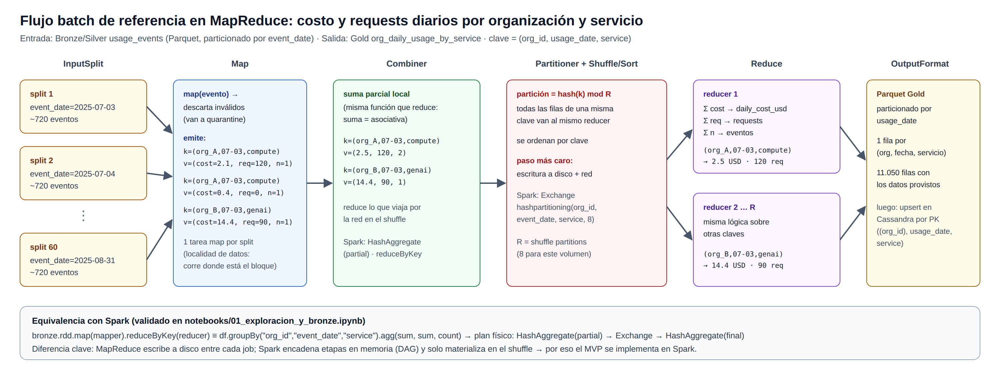

# Cloud Provider Analytics — Documento de diseño v1

**Big Data · ITBA · 2C 2026 · Prof. Diego Mosquera**  
**Primera entrega: diseño y fundación de datos** · versión 1.0 · 05/10/2026  
**Grupo:** Cayetana Peces · Abril Solé · Agustina Edalian · Delfina Vázquez Escati

> Documento corto a propósito: cada sección responde un ítem de la consigna (§5.2) y todas las cifras salen del perfil de datos ejecutado con Spark (`notebooks/01_exploracion_y_bronze.ipynb`).

---

## 1. Problema, usuarios y objetivos medibles

**Problema.** Somos el área de datos de un proveedor de nube. Los datos de clientes llegan crudos, desde sistemas distintos y con errores. Hay que ingestarlos, limpiarlos, conformarlos y publicarlos para tres áreas que hoy no tienen una fuente única y confiable. Se necesitan dos ritmos:

- **near real-time** para el uso y el costo incremental (eventos);
- **batch** diario o mensual para el CRM, la facturación y las encuestas.

| Usuario | Qué decide con los datos | Preguntas principales (consultas obligatorias) |
|---|---|---|
| **FinOps** | Control de costos, revenue y detección de desvíos | Q1 costos y requests diarios por org y servicio en un rango · Q2 top-N servicios por costo en los últimos 14 días · Q4 revenue mensual con créditos e impuestos en USD · alertas de anomalías de costo |
| **Soporte** | Carga operativa y cumplimiento de SLA | Q3 tickets críticos y tasa de SLA breach por día (últimos 30 días) · CSAT por org |
| **Producto / Usage** | Adopción de servicios, GenAI y huella de carbono | Q5 tokens GenAI y costo estimado por día · uso por servicio · carbon_kg |

**Objetivos medibles (criterios de éxito del MVP)**

| # | Objetivo | Métrica / umbral | Cómo se verifica |
|---|---|---|---|
| O1 | Frescura de las métricas de uso | ≤ 10 min entre que el archivo llega a Landing y se ve en Cassandra (micro-lote de 5 min) | `lastProgress` del stream + `ingest_ts` vs hora de consulta |
| O2 | Cero pérdida silenciosa | filas de entrada = filas válidas + filas en quarantine, en cada zona | conciliación de conteos en `_meta/run_log` |
| O3 | Idempotencia | re-ejecutar no cambia ningún conteo (0 duplicados por clave natural) | conteo antes/después (ya demostrado en Bronze) |
| O4 | Compatibilidad de esquema | 100 % de los eventos v1 y v2 presentes en Silver, sin descartar v1 | conteo por `schema_version` en Silver vs Bronze |
| O5 | Revenue comparable | 100 % de las facturas normalizadas a USD | ninguna fila de `revenue_by_org_month` sin `revenue_usd` |
| O6 | Serving eficiente | las 5 consultas leen **una sola partición** de Cassandra y responden en < 1 s | CQL con `WHERE` sobre la partition key + tracing |
| O7 | Anomalías útiles | método y umbral documentados; se revisa si la tasa de flags queda muy por encima del ~1 % de los eventos | `cost_anomaly_mart` + log de decisiones |

---

## 2. ¿Por qué Big Data? Análisis 5V

La muestra provista es chica (≈13 MB). Nuestro argumento **no** es el volumen de la muestra: es el caso real que la muestra simula. Para dimensionarlo usamos el tamaño medido de un evento (~300 bytes en JSON) y un supuesto explícito de escala: **5.000 organizaciones × 20 recursos × 3 métricas, con un evento cada 5 minutos**.

| V | En la muestra (medido) | En el caso real (supuesto) | ¿Dominante? | Decisión de arquitectura que provoca |
|---|---|---|---|---|
| **Volumen** | 43.200 eventos en 60 días (≈720/día), 12,6 MB JSON | ≈86 M eventos/día → ≈26 GB/día en JSON (≈9 TB/año); en Parquet ≈5 GB/día (compresión medida ≈5×) | Media (hoy baja; crece linealmente con los clientes) | Escalado horizontal con Spark; Parquet columnar particionado por fecha; evitar *small files* |
| **Velocidad** | 120 archivos que simulan micro-lotes continuos | ≈1.000 eventos/s; FinOps necesita el costo del día casi en tiempo real | **Alta** | Capa speed con Structured Streaming (trigger de 5 min), checkpoints y upserts |
| **Variedad** | 7 CSV + JSONL semi-estructurado + `tags_json` embebido; esquema v1 → v2 el 18/07 | Más servicios y métricas nuevas con el tiempo | **Alta** | Esquemas explícitos y versionados; Silver unifica v1/v2 con columnas opcionales |
| **Veracidad** | `value` como texto (1.309) o null (877); 2.038 eventos con value sin unit; 216 costos negativos; spikes de hasta 19× el p99; facturas en 3 monedas y 13 subtotales negativos; NPS 101; CSAT 0–7 | Igual o peor en producción | **Alta** | Reglas de calidad por zona + quarantine; `value_raw` conservado; flags de anomalía por grupo |
| **Valor** | Costos, revenue, SLA, GenAI por org | Recortar costos no explicados, anticipar breaches de SLA, facturar GenAI correctamente | Objetivo | Marts Gold por dominio y serving query-first en Cassandra |

**Conclusión.** Las V que dominan este caso son **velocidad, variedad y veracidad**, y justifican un pipeline con streaming, esquemas explícitos y control de calidad. El volumen justifica diseñar para escalar horizontalmente desde el principio, aunque la muestra entre en una sola máquina.

---

## 3. Inventario y perfil de fuentes

Los perfiles son reales: salen de la ejecución con Spark 3.5 (ver `evidence/01_profile_summary.json`). La frecuencia de llegada es un **supuesto**, porque la consigna solo dice "diario o mensual".

| Fuente | Grano (1 fila =) | Clave natural | Formato | Frecuencia (supuesto) | Filas | Calidad observada | Riesgo |
|---|---|---|---|---|---|---|---|
| customers_orgs | organización | org_id | CSV | diaria (snapshot CRM) | 80 | 11 NPS nulos; NPS en escala −100..100 con un valor inválido (101) | Cambios de plan sin historia → SCD |
| users | usuario | user_id | CSV | diaria | 800 | 139 `last_login` nulos | Emails = dato personal |
| resources | recurso cloud | resource_id | CSV | diaria | 400 | 83 `tags_json` nulos; JSON embebido | Parseo de tags |
| support_tickets | ticket | ticket_id | CSV | diaria | 1.000 | 240 sin `resolved_at` (abiertos); 254 CSAT nulos; CSAT observado 0–7 | Escala de CSAT ambigua |
| marketing_touches | interacción | touch_id | CSV | diaria | 1.500 | sin nulos | Fuera del alcance mínimo |
| nps_surveys | encuesta (org, fecha) | (org_id, survey_date) | CSV | diaria | 92 | 19 NPS nulos, 10 comentarios nulos | Muestra chica |
| billing_monthly | factura | invoice_id | CSV | mensual | 240 (3 meses) | USD 160 / ARS 51 / EUR 29; 137 `credits` nulos; 13 subtotales negativos; tipo de cambio de USD entre 0,85 y 1,12 (≠ 1) | Conversión a USD mal aplicada |
| usage_events_stream | evento de uso | event_id | JSONL (120 archivos) | continua (micro-lotes) | 43.200 | v1 10.800 / v2 32.400; `value` texto/null; `unit` null en 2.075; 216 costos < 0; **cada archivo trae eventos de todo el período** | Late data y orden de llegada |

**Integridad referencial:** todos los `org_id` de las 7 fuentes existen en `customers_orgs`, y todos los `resource_id` de los eventos existen en `resources`. **No hay** `event_id` duplicados en la muestra, pero igual se deduplica: en streaming, la reentrega de un archivo o el reprocesamiento sí los generan.

**Trazabilidad:** cada fila de Bronze lleva `source_file` e `ingest_ts`, y en eventos se conserva `value_raw`. Así se puede ir desde un valor de Cassandra hasta el archivo y la línea de origen.

---

## 4. Arquitectura de alto nivel (v1)



| Capa | Responsabilidad | Tecnología (MVP) | Equivalente en producción |
|---|---|---|---|
| Fuentes | Archivos que depositan CRM, billing, soporte y telemetría | Carpeta `landing/` | Buckets S3/GCS, Kafka |
| Ingesta batch | Leer CSV con esquema explícito, agregar columnas técnicas y deduplicar | `spark.read` (PySpark) | Spark en EMR/Dataproc/Databricks |
| Ingesta streaming | Leer el directorio JSONL de forma incremental, con watermark, dedupe y checkpoint | Structured Streaming `readStream` | Ídem + Kafka como fuente |
| Almacenamiento | Data Lake por zonas, en Parquet particionado | Disco de Colab (demo) / Google Drive (persistencia) | Object storage (S3/GCS) o HDFS |
| Procesamiento | Limpieza, conformado, features, anomalías, marts | Spark DataFrames / SQL | Ídem en clúster (YARN/K8s) |
| Serving | Responder las 5 consultas con baja latencia | Cassandra (AstraDB) | Cassandra administrado |
| Consumo | Analistas de FinOps, Soporte y Producto | CQL, notebook, herramienta de BI | Dashboards |
| Transversal | Calidad, metadatos, linaje, seguridad, observabilidad | Reglas en código, `_meta/`, secretos de Colab | Catálogo (Glue/Unity), Airflow, monitoreo |

**Separación de cómputo y almacenamiento.** Los datos viven en archivos Parquet y Spark los procesa sin "ser dueño" de ellos. Eso permite recalcular Gold desde Bronze, cambiar de motor o escalar el cómputo sin mover datos. Es el mismo principio de HDFS y YARN aplicado sobre object storage.

---

## 5. Patrón elegido: **Lambda** (con una sola base de código)

| Criterio | Batch puro | **Lambda (elegido)** | Kappa |
|---|---|---|---|
| Frescura de uso y costos (O1) | ✗ horas | ✓ minutos (capa speed) | ✓ minutos |
| Maestros y facturación, naturalmente batch | ✓ | ✓ se procesan como lo que son | ✗ obliga a convertir CSV mensuales en streams |
| Corrección de late data y cambios de reglas | ✓ | ✓ el recálculo batch corrige la capa speed | ~ requiere re-stream de todo el histórico |
| Complejidad | Baja | Media: dos caminos, **mitigado** porque Spark usa la misma API y las mismas funciones de transformación en batch y streaming | Media-alta para las fuentes batch |

**Por qué Lambda y no Kappa, con datos del perfil.**

1. **Cada archivo de eventos trae eventos de los 60 días** (rango promedio de 59,7 días por archivo). En un stream, esto es *late data* masiva. Un watermark corto descartaría eventos válidos y uno largo dejaría crecer demasiado el estado. Con Lambda, la capa speed publica rápido una versión incremental, y el **recálculo batch diario desde Bronze** deja los marts exactos. El costo final no depende del orden en que llegaron los archivos.
2. Facturación (3 meses), CRM y encuestas son **batch por naturaleza**. Tratarlos como streams (Kappa) agrega complejidad sin aportar frescura.
3. El requisito invariable de la consigna (streaming de eventos + batch de maestros) calza directamente con las dos capas de Lambda.

**Cómo se reconcilian las capas:** ambas escriben en Gold y en Cassandra con **upsert por la misma clave natural**, por ejemplo `(org_id, usage_date, service)`. El recálculo batch sobrescribe la fila con el valor definitivo. No hay duplicados ni una vista de merge extra.

---

## 6. Matriz requisito → componente (y relación con las 5V)

| Req. | Requisito (consigna / objetivos) | V que lo motiva | Componente | Evidencia prevista |
|---|---|---|---|---|
| R1 | Ingesta batch de CSV a Bronze con esquema explícito, `ingest_ts`, `source_file` | Variedad, veracidad | Job batch `spark.read` → Bronze | ✅ notebook 01 (ya implementado) |
| R2 | Streaming de eventos con watermark, dedupe por `event_id`, late data y checkpoint | Velocidad | Structured Streaming → Bronze | 2ª entrega |
| R3 | Landing inmutable | Veracidad | Zona Landing de solo lectura | ✅ notebook 01 no escribe en Landing |
| R4 | Evolución de esquema v1/v2 | Variedad | Esquema con campos opcionales + conformado en Silver | ✅ perfil v1/v2 · Silver en 2ª entrega |
| R5 | Casteo con fallback de tipos ambiguos | Veracidad | `value_raw` → `value_num` en Bronze | ✅ notebook 01 |
| R6 | Reglas de calidad + quarantine | Veracidad | Validador por zona → `quarantine/` | Reglas definidas (§7.4); implementación en 2ª entrega |
| R7 | Normalización (números, fechas, USD) y joins | Variedad, valor | Silver | 2ª entrega |
| R8 | Features: daily_cost_usd, requests, cpu_hours, storage_gb_hours, genai_tokens, carbon_kg | Valor | Silver → Gold | ✅ prototipo MapReduce/Spark (§9) |
| R9 | Anomalías con método justificado | Veracidad, valor | `cost_anomaly_mart` (MAD por servicio y métrica) | ✅ análisis preliminar en notebook 01 |
| R10 | Marts FinOps, Soporte y Producto | Valor | Gold | Diseño (§7) |
| R11 | Serving query-first para las 5 consultas | Velocidad, valor | Cassandra/AstraDB | Modelo preliminar (§8) |
| R12 | Idempotencia | Veracidad | Checkpoints + claves naturales + overwrite dinámico + upsert | ✅ demostrado en Bronze |
| R13 | Performance: particiones, control de archivos | Volumen | `partitionBy`, `repartition`/`coalesce`, `shuffle.partitions` | ✅ rutas y tamaños en notebook 01 |
| R14 | Gobierno transversal | Veracidad | `_meta/run_log`, diccionario, secretos, roles | Diseño (§4, §7.5) |

---

## 7. Diseño del Data Lake

### 7.1 Zonas, responsabilidades y reglas de promoción

| Zona | Quién escribe | Quién lee | Contenido | Regla para **promover** a la siguiente zona |
|---|---|---|---|---|
| **Landing** | Sistemas fuente (nunca el pipeline) | Jobs de ingesta | Archivos originales, sin tocar | El archivo es legible y su nombre respeta el patrón esperado |
| **Bronze** | Jobs de ingesta (batch y streaming) | Jobs de Silver, auditoría | Mismo grano, tipos explícitos, `ingest_ts`, `source_file`, dedupe por clave natural; `value_raw` + `value_num` | La fila tiene clave no nula, fecha parseable y esquema válido. Si no, va a quarantine |
| **Silver** | Jobs de conformado | Jobs de Gold, analistas avanzados | v1/v2 unificados, strings normalizados, USD, joins con `dim_org` y `resources`, flags (`is_cost_anomaly`, `unit_imputed`) | Pasa las reglas de calidad (§7.4) y la conciliación: entrada = salida + quarantine |
| **Gold** | Jobs de marts | Carga a Cassandra, BI | Marts con grano declarado | Chequeo de conciliación (Σ costo Silver = Σ costo Gold) y unicidad del grano |
| **Quarantine** | Validadores de Bronze y Silver | Data stewards | Fila original + `rule_id` + `motivo` + `ingest_ts` | Se reprocesa cuando se corrige la regla o la fuente |

### 7.2 Formatos, particiones y naming

| Dataset | Zona | Formato | Partición | Justificación |
|---|---|---|---|---|
| `usage_events` | Bronze / Silver | Parquet snappy | `event_date` | Todas las consultas filtran por rango de fechas (partition pruning). Da 60 particiones de ~40 KB en la muestra y ~5 GB/día a escala real |
| maestros (`customers_orgs`, `users`, `resources`, `support_tickets`, `nps_surveys`, `marketing_touches`) | Bronze | Parquet | `ingest_date` (snapshot) | Permite reconstruir el estado de cualquier día y alimentar un SCD tipo 2 |
| `billing_monthly` | Bronze / Silver | Parquet | `billing_month` | La facturación llega y se consulta por mes |
| `dim_org` | Silver | Parquet | sin partición | 80 filas: particionar sería puro overhead |
| marts diarios | Gold | Parquet | `usage_date` / `ticket_date` | Coincide con el grano y con el filtro de las consultas |
| `revenue_by_org_month` | Gold | Parquet | `month` | Grano mensual |
| `quarantine/<fuente>` | Quarantine | Parquet | `rule_id`, `ingest_date` | Permite ver rápido qué regla falla y cuándo |

- **Decisión explícita: no particionar eventos por `service`.** Con este volumen daría 360 carpetas de pocos KB (el problema de *small files* visto en HDFS: más metadatos en el NameNode y más tareas que datos). Se revisa si un día supera ~128 MB.
- **Control de archivos:** `repartition("event_date")` antes de escribir da 1 archivo por fecha, y `coalesce(1)` se usa en los maestros chicos. Medido: 60 archivos para eventos y 1 por maestro.
- **Naming:** zonas `landing/ bronze/ silver/ gold/ quarantine/`; datasets en `snake_case`; particiones con el formato Hive `columna=valor`; columnas con sufijo de unidad o tipo (`_usd`, `_kg`, `_ts`, `_date`) y prefijo `is_` para los flags.
- **Esquemas versionados** en código (`src/common/schemas.py`); la columna `schema_version` se conserva hasta Silver.

### 7.3 Retención

| Zona | Retención | Motivo |
|---|---|---|
| Landing | 90 días (después, archivo frío) | Auditoría y reprocesamiento desde el origen |
| Bronze | 1 año | Recalcular Silver y Gold ante cambios de reglas |
| Silver | 2 años | Análisis histórico y reentrenamiento |
| Gold | 3 años | Reporting de negocio |
| Quarantine | 30 días después de resuelto | Evitar que se convierta en un pantano de datos |
| `_checkpoints` | Mientras el stream exista | Se borran solo para un reinicio controlado |

### 7.4 Metadatos y reglas de calidad iniciales

**Metadatos técnicos:** `ingest_ts`, `source_file`, `schema_version` y `run_id`. Cada ejecución deja una fila en `_meta/run_log` con: job, zona, filas de entrada, válidas, en quarantine, duración y estado.

**Metadatos de negocio:** diccionario de datos en `docs/` con el dueño de cada dataset (ver roles, §11).

| Regla | Zona | Tratamiento | Evidencia del perfil |
|---|---|---|---|
| `event_id` no nulo y único | Bronze | nulo → quarantine; duplicado → dedupe | 0 nulos / 0 duplicados en la muestra (la regla protege el reprocesamiento) |
| `cost_usd_increment >= -0.01` | Silver | < −0.01 → quarantine + `is_cost_anomaly`; entre −0.01 y 0 → redondeo a 0 | 211 eventos bajo la tolerancia |
| `unit` no nulo cuando hay `value` | Silver | Imputación **determinística** por métrica (requests→count, cpu_hours→hours, storage_gb_hours→gb_hours) + flag `unit_imputed` | La relación métrica→unidad es 1:1 en los 41.125 eventos con unit; faltan 2.038 |
| `value` numérico | Bronze | Casteo con fallback, se conserva `value_raw` | 1.309 textos, todos castean |
| `org_id` existe en `dim_org` | Silver | Si no existe → quarantine | 0 huérfanos hoy |
| `schema_version ∈ {1,2}`, timestamp parseable | Bronze | Si no → quarantine | 100 % válidos |
| Moneda ∈ {USD, ARS, EUR} y `exchange_rate_to_usd > 0` | Silver | Si no → quarantine | 3 monedas |
| NPS ∈ [−100, 100] | Silver | Fuera de rango → null + flag | 1 valor (101) |

### 7.5 Seguridad y gobierno (inicial)

- Token de AstraDB en **secretos de Colab** o variables de entorno; `config/*.example.yaml` en el repo **sin** credenciales, y `.gitignore` para `datalake/` y `secrets`.
- `users.email` se clasifica como **dato personal**: no se publica en Gold ni en Cassandra.
- Acceso por zona según el principio de mínimo privilegio: los analistas leen Gold; solo los jobs escriben.

---

## 8. Flujos de datos batch y streaming (herramientas concretas)

**Flujo batch (capa batch: diario, más mensual para facturación)**

1. `spark.read.schema(...).csv(landing/*.csv)` → agregar `ingest_ts` y `source_file` → `dropDuplicates(clave)` → `write.partitionBy(ingest_date | billing_month).parquet(bronze/…)` con overwrite dinámico por partición (idempotente).
2. Silver: armar `dim_org` (último snapshot, SCD1 en el MVP) y `billing_usd`, con `revenue_usd = (subtotal − coalesce(credits,0) + taxes) × exchange_rate_to_usd`. Los tickets se tipan: fechas, `sla_breached` como booleano y `is_critical`.
3. **Recálculo nocturno** de los marts de eventos desde Bronze/Silver (corrige el late data de la capa speed).
4. Gold: `revenue_by_org_month`, `tickets_by_org_date` y los marts de eventos → carga a Cassandra con el **Spark Cassandra Connector** (upsert por PK).

**Flujo streaming (capa speed)**

1. `spark.readStream.schema(EVENTS_SCHEMA).option("maxFilesPerTrigger", N).json(landing/usage_events_stream/)`.
2. `withWatermark("event_ts", umbral)` + `dropDuplicates(["event_id"])` (o `dropDuplicatesWithinWatermark`) → append en Bronze con `checkpointLocation` propio.
3. `foreachBatch` (trigger de 5 min): casteos y reglas → quarantine / Silver → recalcular **solo las claves `(org, fecha, servicio)` afectadas por el micro-lote** → upsert en Gold y Cassandra.
4. Observabilidad: `query.lastProgress` (filas por segundo, lag) se registra en `_meta/run_log`.

**Decisión abierta:** el valor del watermark. El perfil muestra que cada archivo abarca todo el período, así que en la demo el watermark se usa para acotar el estado del dedupe, y la exactitud la garantiza el recálculo batch. El umbral se calibra en la 2ª entrega.

**Modelo de serving preliminar (query-first)** — el detalle final se define en la clase de Cassandra (02/11):

| Consulta | Tabla | Partition key | Clustering | Por qué |
|---|---|---|---|---|
| Q1 costos y requests por org/servicio en un rango | `usage_by_org_date` | `org_id` | `usage_date DESC, service` | El rango de fechas se resuelve dentro de una partición (~2.200 filas/año por org) |
| Q2 top-N servicios últimos 14 días | `top_services_14d` | `(org_id, as_of_date)` | `rank` | Cassandra no ordena por un agregado: el ranking se precalcula en Spark |
| Q3 tickets críticos y SLA breach por día | `support_daily_sla` | `severity` | `ticket_date DESC` | Una partición por severidad; 30 días = 30 filas |
| Q4 revenue mensual en USD | `revenue_by_org_month` | `org_id` | `month DESC` | Serie mensual por org |
| Q5 tokens GenAI y costo por día | `genai_by_org_date` | `org_id` | `usage_date DESC` | Serie diaria por org |

Keyspace `cloud_analytics` con replicación administrada por AstraDB (RF = 3) y lectura/escritura en `LOCAL_QUORUM`.

---

## 9. Flujo batch de referencia en MapReduce



```text
// Transformación: costo y requests diarios por (org_id, usage_date, service)
map(evento):
    if evento.event_id is null or evento.org_id not in dim_org: emit_quarantine(evento); return
    requests = evento.value_num if evento.metric == "requests" else 0
    emit( key=(evento.org_id, date(evento.event_ts), evento.service),
          value=(evento.cost_usd_increment, requests, 1) )

combine(key, values):           // igual que reduce: la suma es asociativa y conmutativa
    emit(key, (Σ cost, Σ requests, Σ n))

partition(key) = hash(key) mod R   // todas las filas de una clave van al mismo reducer

reduce(key, values):
    emit(key, daily_cost_usd = Σ cost, requests = Σ requests, eventos = Σ n)
    // salida → Parquet Gold particionado por usage_date → upsert en Cassandra
```

**Validado en Spark (notebook 01, §6).**

- La versión RDD `map(...).reduceByKey(...)` y la versión DataFrame `groupBy(...).agg(...)` dan las mismas **11.050 claves**.
- El plan físico muestra `HashAggregate(partial)` (el *combiner*), `Exchange hashpartitioning` (el *shuffle*) y `HashAggregate(final)` (el *reduce*).
- **Joins:** para `revenue_by_org_month`, la unión billing × dim_org sería un *reduce-side join* en MapReduce (las dos fuentes emiten `org_id` como clave). Como `dim_org` tiene 80 filas, en Spark conviene un **broadcast join**, que evita el shuffle.

---

## 10. Supuestos, riesgos, mitigaciones y decisiones abiertas

**Supuestos**

1. `revenue_usd = (subtotal − credits + taxes) × exchange_rate_to_usd` (el tipo de cambio de ARS, ≈0,0015, confirma que se multiplica). Un `credits` nulo equivale a 0.
2. Un subtotal negativo es una nota de crédito o un ajuste: se conserva con el flag `is_adjustment`.
3. El NPS está en escala −100..100 (la de una organización) y el CSAT se espera en 1–5.
4. La frecuencia de llegada es diaria para el CRM y mensual para la facturación; los eventos llegan continuamente.
5. La escala real usada en el análisis 5V es un supuesto de dimensionamiento, no un dato provisto.

| Riesgo | Impacto | Prob. | Mitigación |
|---|---|---|---|
| Colab borra el disco al reiniciar (se pierden los checkpoints y el lake) | Alto | Alta | Lake y checkpoints en **Google Drive** montado; dataset de demo chico; script de limpieza y reinicio |
| Late data masivo (cada archivo abarca 60 días) | Alto | Cierta | Lambda: el recálculo batch corrige; upsert por clave natural |
| Conexión a AstraDB (token, bundle, conector) falla en la demo | Alto | Media | Probar la conexión en la semana 1 de la 2ª etapa; guardar evidencia (capturas y CSV de resultados); plan B con driver Python + `foreachBatch` |
| Umbral de anomalías mal calibrado (el global marca 25 % o casi nada) | Medio | Alta | MAD por (servicio, métrica), medido en el notebook 01; umbral documentado en DECISIONS |
| Conversión de moneda errónea | Alto | Media | Test unitario con una factura conocida de cada moneda; conciliación del total |
| Escala de CSAT ambigua (0–7) | Bajo | Cierta | Consultar al docente; mientras tanto, fuera de rango → null + flag |
| Desbalance de carga y conocimiento en el grupo | Medio | Media | Roles por capa + revisión cruzada; repo con README y DECISIONS al día |
| Hot partitions en Cassandra | Medio | Baja | Partition keys por org; bucket por mes si una partición crece |

**Decisiones abiertas (para el feedback):** valor del watermark · SCD1 vs SCD2 para `dim_org` · tratamiento final de USD con tipo de cambio ≠ 1 · escala de CSAT · si Q3 es global o por organización (hoy se diseña global por severidad, con `tickets_by_org_date` como alternativa) · componente analítico (anomalías como capacidad analítica vs un modelo ML).

---

## 11. Estimación de esfuerzo, roles y recursos

**Roles propuestos** (a validar por el grupo)

| Integrante | Rol principal | Dueño de |
|---|---|---|
| Cayetana Peces | Ingesta y Data Lake | Bronze batch y streaming, checkpoints, particiones |
| Abril Solé | Procesamiento y calidad | Silver, reglas, quarantine, features, anomalías |
| Agustina Edalian | Serving y analítica | Gold, modelo Cassandra, carga, consultas CQL |
| Delfina Vázquez Escati | Arquitectura y gobierno | Diseño, repo, README, DECISIONS, run_log, linaje, integración |

**Esfuerzo estimado (horas-persona)**

| Etapa | Trabajo | Horas |
|---|---|---|
| E1 · Diseño (hasta 05/10) | Documento, diagrama, notebook de exploración y Bronze, repo | 36 |
| E2 · Implementación (hasta 16/11) | Streaming, Silver, calidad, `org_daily_usage_by_service`, AstraDB + 2 consultas, idempotencia, README | 96 |
| E3 · MVP (hasta 07/12) | 5 marts, 5 consultas, anomalías, gobierno, pruebas, presentación, video, defensa | 72 |
| **Total** | | **≈204 h (≈51 h por persona)** |

**Recursos:** Google Colab gratuito (2 vCPU, ~12 GB RAM, Spark `local[*]`), alcanza para la muestra · Google Drive (< 200 MB) · AstraDB free tier · GitHub · sin costo monetario.

---

## 12. Repositorio y evidencia de exploración

- **Repo:** estructura recomendada por la consigna (§8.1), con README, `DECISIONS.md`, `config/`, `notebooks/`, `evidence/` y `docs/`.
- **Evidencia:** `notebooks/01_exploracion_y_bronze.ipynb`, ejecutado con PySpark 3.5.3:
  - lee las 8 fuentes con esquemas explícitos, las perfila y escribe Bronze (8 datasets, 60 particiones de eventos);
  - demuestra la idempotencia (43.200 → 43.200 al re-ejecutar);
  - reproduce el flujo MapReduce;
  - salidas en `evidence/01_profile_summary.json` y `evidence/01_event_time_range_by_file.csv`.
- **Próximos pasos (2ª entrega):** streaming a Bronze → Silver de eventos y `dim_org` → reglas y quarantine → `org_daily_usage_by_service` → AstraDB con Q1 y Q2 → prueba de idempotencia end-to-end.
